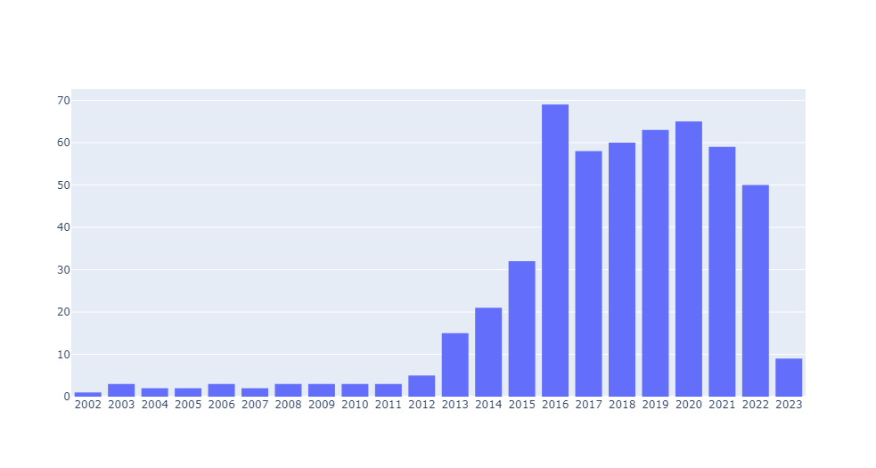
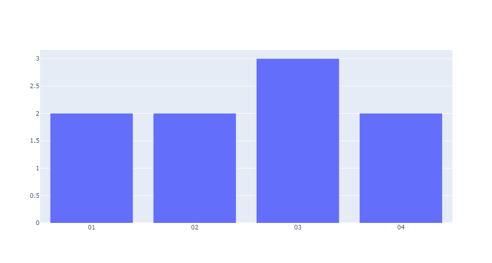
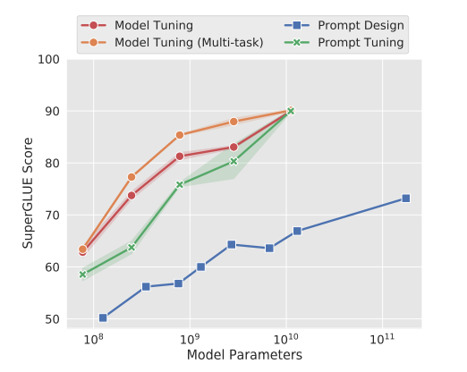

# Topic Modelling from Chinese Meeting Notes
This project focuses on performing topic modelling for Chinese meeting notes and conducting extensive topic analysis. The main objectives of the work are as follows:

- Task 1: Find the topic of each meeting note.
- Task 2: Identify the top 3 emerging topics in Year 2023.
- Task 3: Analyze and identify subtopics and key messages within the meeting notes for one topic in task 2.

# Data Exploration
Please refer to [EDA.ipynb](EDA.ipynb) for details.

The raw data file data/meeting_notes.csv consists of 531 notes from 496 meetings. However, there are two duplicated notes with the same content. 
The duplicated row corresponds to the note for the `政治局会议` with the title `研究部署在全党深入开展党的群众路线教育实践活动`. 
It appears to be a typo as the two rows only differ by one character in the `TITLE` field.

To address this issue, the row with the typo in the title was removed, and the cleaned data was saved to the file `data/meeting_notes_clean.csv`.

The histogram below illustrates the distribution of notes by year. It is evident from the histogram that the number of notes in the year 2023 is significantly smaller compared to the year 2022. 
Specifically, there are 9 notes recorded in 2023, whereas 50 notes were documented in 2022.


Upon closer examination of the notes from Year 2023, we observe that the available notes span only from January to April: 



# Task 1: Find the topic of each meeting note
In the given task, there are a total of 24 pre-defined topics. Considering that each note consists of multiple paragraphs, 
and these paragraphs may discuss different topics, it is more reasonable to classify the topic at the paragraph level rather than the document level.

To address the challenge of having pre-defined topics without training data, I manually labeled certain paragraphs for training purposes, 
which are stored in the file `data/labelled_sample.csv`. Additionally, some other paragraphs were labeled for testing and saved in `data/labelled_test.csv`.

Typically, this task would involve classification. However, building a classification model with 24 classes using a small training dataset may not yield satisfactory performance. 
Therefore, for this task, large language models (LLMs) are employed to achieve better results.

## 1. LLMs and improvement
There are two approaches to involve LLMs. One is to use OpenAI API to call GPT models. The other is to use open-sourced LLMs
which can be deployed locally, such as [`LLaMA`](https://github.com/facebookresearch/llama), [`Vicuna`](https://github.com/lm-sys/FastChat) 
and [`ChatGLM`](https://github.com/THUDM/ChatGLM-6B)[[1]](#1).
The following table compares some key features of the two approaches.

|  Feature   |             OpenAI API              |                 Open-sourced models                 |
|:----------:|:-----------------------------------:|:---------------------------------------------------:|
|    Size    | 175B for ChatGPT, unknown for GPT-4 |        Most models have 6B, 7B, 13B versions        |
|   Usage    |              Paid API               |              Mostly non-commercial use              |
|    Code    |            Not available            | Mostly available for train, inference and fine-tune |
| Limitation |  Monthly quota on number of tokens  |        Need large GPU for better performance        |

LLMs are trained on general data and may not perform optimally when applied to specific data tasks. 
To address this challenge, there are several approaches to incorporate task-specific samples. 
These approaches include: few-shot learning, P-tuning, Prompt-tuning, Fine-tuning with LoRA.
While few-shot learning is to explicitly put some examples in the prompt, the rest 3 methods employ a training process with a small training samples,
and have been shown to be efficient and comparable to fully fine-tuning. See paper: [The Power of Scale for Parameter-Efficient Prompt Tuning
](https://arxiv.org/pdf/2104.08691.pdf)[[2]](#2).


Prior to this task, my team has conducted benchmarking analysis of `LLaMA-13B`, `Vicuna-13B`, `ChatGLM-6B` and `ChatGPT`. We designed questions from several
aspects to compare their performance both in English and Chinese. The result shows `ChatGPT` is always the best, and `ChatGLM-6B` is ranked second on Chinese questions.
`ChatGLM` is developed by Tsinghua University and gained immense popularity. Recently the enhanced version [`ChatGLM2-6B`](https://github.com/THUDM/ChatGLM2-6B/tree/main)
was released with new features and better performance. So `ChatGLM2-6B` is selected for this task.

## 2. Topic classification at paragraph-level

In this work:
- For `GPT-4`,  I tested [zero-shot learning and few-shot learning](GPT-FewShot-Test.ipynb). The accuracy of zero-shot learning is `87.5%` and that of few-shot learning is `79.2%`.
- For `ChatGLM2-6B`, I tested [zero-shot learning, few-shot learning](Google_Colab/ChatGLM2_6B_zero_shot_vs_few_shot.ipynb), and [P-tuning](Google_Colab/ChatGLM2_6B_P_Tuning_v2.ipynb). 
The accuracy of zero-shot learning is `12.5%` and that of few-shot learning is `8.3%`. The accuracy of P-tuning is `58.3%`, which is `66.7%` of `GPT-4`.
Considering the size of `ChatGLM2-6B` is only about `3.4%` of `ChatGPT`, it is worth noting that P-tuning exhibits a significant improvement in accuracy compared to both zero-shot and few-shot learning. 

The decrease in performance from zero-shot learning to few-shot learning can potentially be attributed to the limited size of the sample data used in the latter approach.

Due to the quota limitations of the OpenAI API, I was only able to generate a small sample set using [`GPT-4` model zero-shot learning](GPT-4%20Zero%20Shot%20Paragraph.ipynb).
In cases where the data contains sensitive information that cannot be sent to the OpenAI API, utilizing open-sourced models becomes the only viable option.
To classify the topic for entire dataset, [ChatGLM2 with P-tuning](Google_Colab/ChatGLM2_6B_P_Tuning_v2.ipynb) is applied to the paragraph-level content `data/all_para.csv` and titles `data/title_topic.csv`.

Sometimes LLMs do not follow the prompt to pick a topic from pre-defined list. In this task, we map the new topic to one of the pre-defined topics in the following steps:
- Get the embeddings of the new topic and the pre-defined topics.
- Find the pre-defined topic which has the most similar embeddings to the new topic.
- If the highest similarity score is lower than the threshold, then drop this paragraph. This assumes all paragraphs do not talk about any new topic.
For the case where some paragraph is talking about new topics, refer to [here](#4-what-about-new-topics).

Titles also play an important role in topic identification. So the same approach for paragraphs also applies to titles.

After [the topic at paragraph-level and the topic for each title are generated](Google_Colab/Aggregate_Topic.ipynb), these topics are aggregated to document level.

## 3. Topic aggregation to document-level

For each document / note, the topic is aggregated by the following steps:
- Get the top 2 frequent topics from its paragraphs.
- Include the topic obtained from the title.
- Remove duplicates from the 3 topics produced above.

The final output is [generated](Topic%20Aggregation%20Clean.ipynb) and saved to `data/id_topics_all.csv`.

## 4. What about new topics?

There are two scenarios where a LLM may generate a new topic for a paragraph:

- The paragraph discusses a topic that is already present in the pre-defined list, but the LLM did not strictly adhere to the provided prompt.
In such cases, we can identify the topic from the pre-defined list that has the most similar embedding to the embedding of the generated new topic.

- The paragraph introduces a genuinely new topic that is not covered by the pre-defined list. 
To detect this scenario, a similarity threshold can be set when searching for the most similar topic, similar to the first case.
Once all such new topics have been identified, the LLM can be utilized again to cluster these new topics into a smaller number of more focused topics. 
These newly clustered topics can then be suggested for inclusion in the pre-defined list.

# Task 2: Identify the top 3 emerging topics in Year 2023.
To identify emerging topics in Year 2023, the first thought is to compare the topic frequency in Year 2022 and in Year 2023.
Since there are only 9 notes in Year 2023, it is more meaningful to [compare the frequency in percentage](Emerging%20Topics%202023%20Clean.ipynb).
For each topic, the increase from Year 2022 to Year 2023 is measured by `percentage in Year 2023 - percentage in Year 2022`.

The top 3 topics that experienced the highest increase from Year 2022 to Year 2023, sorted in descending order, are as follows:
- `企业发展`
- `就业`
- `区域发展`

# Task 3: Analyze and identify subtopics and key messages within the meeting notes for one topic in task 2.

`企业发展` was selected here because it was ranked top 1 in task 2, and has the largest number of notes in Year 2023.
There are several ways to extract topics and key messages from a list of texts.
- LDA: LDA is a topic modeling algorithm that helps uncover the underlying thematic structure in a collection of documents. It is an unsupervised machine learning technique that allows us to discover latent topics and their distribution in a corpus.
- Summarizer: Summarizer automatically generates a concise and coherent summary that captures the most important information from a given text or set of texts. The key idea is to leverage natural language processing techniques to identify significant sentences or passages that effectively represent the main points or key messages of the original content.
- LLM: LLM leverages the capabilities of a pre-trained language model, such as `GPT-4`, to automatically identify and generate concise summaries or key messages from a given text or set of texts. The key idea is to utilize the language model's understanding of context, semantics, and grammar to extract the most relevant and informative content.

[LDA, summarizer and GPT-4 are tested](Subtopics%20Year%202023.ipynb). `ChatGLM2-6B` is also [tested](Google_Colab/Identify_topics_and_key_messages.ipynb).
The result from `GPT-4` is the most meaningful one:
- 国有经济管理和改革：加强和改进国有经济管理，完善国有经济安全责任、质量结构、资产和企业管理，深化国有企业改。
- 民营经济发展和优化：支持和促进民营经济发展，优化民营经济发展环境，解决制度障碍，以及破除影响各类所有制企业公平竞争、共同发展的法律法规障碍和隐性壁垒。
- 全面深化改革：定位改革方向，明确目标任务，以及通过科学的谋划、创新的魄力来确保各项工作的推进。
- 企业发展和科技创新：侧重科技创新在企业发展中的重要性，持续提振经营主体信心，帮助企业恢复元气。
- 党的领导和监督：强调领导干部个人有关事项报告制度的重要性，以及进一步加强对领导干部的管理和监督。
- 经济发展的总体基调：坚持稳中求进工作总基调，全面深化改革开放，形成推动高质量发展的强大动力，统筹推动经济运行持续好转、内生动力持续增强、社会预期持续改善、风险隐患持续化解。

# Conclusion

In this work, I conducted experiments using LLMs, specifically `GPT-4` and `ChatGLM2-6B` to classify topics in lengthy meeting notes. 
 I explored different improvement approaches, including few-shot learning and P-tuning. The results indicate that `GPT-4` outperformed other models in terms of performance. 
However, two critical issues were identified:
- Scalability issue: The quota limitation of the OpenAI API posed a challenge for scaling up the experiments.
- Data privacy issue: The sensitivity of the meeting note data prevented the use of certain methods that require sending data to external APIs.

P-tuning of `ChatGLM2-6B` on a small sample set achieves 66.7% of the performance of `GPT-4`. 
The notable improvement shown by `ChatGLM2-6B`, despite its size being approximately `3.4%` of `ChatGPT`, along with its suitability for local deployment, 
highlights the immense potential of this approach for a wide range of applications.

For topic extraction, I compared LDA, summarizer and LLMs. The comparative analysis revealed that LLMs, especially `GPT-4`, produced the most favorable results for topic extraction.

# Dependencies

In this work, the model `ChatGLM2-6B` was running on one V100 GPU in GCP.

Install all requirements:

```shell
pip3 install -r requirements.txt
```
`Python` version is `3.10` or later.
# Code and Data

## EDA:
- Run [EDA.ipynb](EDA.ipynb) to perform data exploration and output cleaned version of raw data `data/meeting notes clean.csv`.
## Task 1:
- Manually labelled some paragraphs for training `data/labelled_sample.csv` and some others for testing `data/labelled_test.csv`.
- Run [GPT-FewShot-Test.ipynb](GPT-FewShot-Test.ipynb) to perform `GPT-4` zero-shot learning and few-shot learning on sample data.
- Run [GPT-4 Zero Shot Paragraph.ipynb](GPT-4%20Zero%20Shot%20Paragraph.ipynb) to split content into paragraphs and saved to `data/all_para.csv`.
- Run [ChatGLM2_6B_zero_shot_vs_few_shot.ipynb](Google_Colab/ChatGLM2_6B_zero_shot_vs_few_shot.ipynb) to perform `ChatGLM2-6B` zero-shot learning and few-shot learning on sample data.
- Run [ChatGLM2_6B_P_Tuning_v2.ipynb](Google_Colab/ChatGLM2_6B_P_Tuning_v2.ipynb) to perform P-tuning of `ChatGLM2-6B`, 
and produce topics for all paragraphs and all titles. Outputs are saved to `data/generated_predictions_all.txt` and `data/generated_predictions_title.txt`.
- Run [Topic Mapping.ipynb](Topic%20Mapping.ipynb) to produce raw topics for all paragraphs and all titles.
Outputs are saved to `data/para_topic.csv` and `data/title_topic.csv`.
- Run [Aggregate_Topic.ipynb](Google_Colab/Aggregate_Topic.ipynb) to aggregate topics for each note and save to `data/id_topic_3.csv`. 
It also produces the clean version for all paragraphs and all titles.
Outputs are saved to `data/para_topic_clean.csv` and `data/title_topic_clean.csv`.
- Run [Topic Aggregation Clean.ipynb](Topic%20Aggregation%20Clean.ipynb) to produce the final clean topics for each note and save to `data/id_topics_all.csv`.
## Task 2:
- Run [Emerging Topics 2023 Clean.ipynb](Emerging%20Topics%202023%20Clean.ipynb) to identify top 3 emerging topics in Year 2023.
## Task 3:
- Run [Subtopics Year 2023.ipynb](Subtopics%20Year%202023.ipynb) to compare LDA, summarizer and `GPT-4` to extract subtopics and key messages.
- Run [Identify_topics_and_key_messages.ipynb](Google_Colab/Identify_topics_and_key_messages.ipynb) to extract subtopics and key messages using `ChatGLM2-6B`.

# References

<a id="1">[1]</a> 
Zeng et al., (2022). 
Glm-130b: An open bilingual pre-trained model.
arXiv preprint arXiv:2210.02414

<a id="2">[2]</a> 
Lester, Brian  and
      Al-Rfou, Rami  and
      Constant, Noah, (2021). 
The Power of Scale for Parameter-Efficient Prompt Tuning.
Proceedings of the 2021 Conference on Empirical Methods in Natural Language Processing